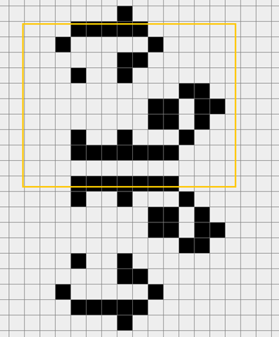

### 一、综述

生命游戏是英国数学家约翰·何顿·康威在1970年发明的细胞自动机。他的规则很简单：整个游戏由网格构成，每一个格子代表一个细胞。如果一个活细胞周围8个细胞中有三个以上或者两个以下活细胞，则该细胞在下一回合死亡；若一个死细胞周围有3个活细胞，则该细胞在下一回合重生。

这一游戏中存在许多有趣的图案，也衍生出许多数学问题。本软件是一款研究生命游戏的工具，内部集成了许多功能和一些基础图形，方便进行娱乐和研究。

### 二、界面介绍

主界面大部分内容是绘制画面，左侧是工具栏，顶部是菜单栏

#### 工具栏：

- （1）选择
	- 初始状态默认是选择状态。在其他状态时点击“选择”按钮进入选择状态。选择状态下，使用鼠标单击某一方块可以选中该方块，方块会变成粉色；使用鼠标拖拽可以对已经画出的图案进行框选。被选中的图案会变成绿色与未选中进行区分。选中后，按下delete或backspace键可以删除选中图案；按下c键复制，选中另一个方块后，按下v可以粘贴。粘贴时以选中方块作为选中图案矩阵的中心点。

图 2框选

图 3 框选后

 

图 4 点击选中

图 5 复制

- （2）画笔
	- 点击“画笔”按钮进入画笔模式，该模式下，鼠标单击某一方块可以逆转其生死状态，鼠标拖拽可以将路径上的方块设置为“生”。

- （3）擦除
	- 点击“擦除”按钮进入擦除模式。该模式下，鼠标点击某一方块可以将其设置为“死”，鼠标拖拽可以将路径上的方块设置为“死”。

- （3）下一步
	- 显示按照生命游戏规则计算后的下一轮的细胞矩阵情况

- （4）开始、暂停
	- 以一定周期每周期自动模拟下一步。
	- 点击开始后，仍然可以使用选择、画笔、擦除工具对正在运行的界面进行修改，一切功能正常。

- （5）恢复初始
	- 在**只点击（一次或多次）**“下一步”或“开始”或“暂停”之后，点击“恢复初始”按钮，可以回到没有点击上述按钮之前的状态。该功能用来方便对设计的图案进行验证后，迅速的恢复到初始状态。

#### 底部输入框

- （1）网格宽：设置网格的宽度，默认为80格宽

- （2）网格高：设置网格的高度，默认为80格高。再重新设置网格宽、高之后，原有的图案不会消失，但是超出当前网格边界的图形会被丢弃，使用时应当注意

- （3）周期：
	- 点击“开始”按钮后，图像刷新的周期，单位是ms，默认为300ms。如果周期设置过短，计算机无法完成计算，则软件会出现异常。

- （4）边长：每一个方格的边长，默认为20像素。

#### 菜单栏。

- 第一栏是“文件”菜单，其中有“打开”“保存”“另存为”三个按钮。保存、打开的文件类型不限，可以自己使用txt文档批量编写图形，文件内容规划稍后会提到。

图 6 “打开”

- 第二栏是“模块”菜单，用户可以选用已经设计好的一些小模块，直接嵌入到游戏界面中。

图 7 “组件”

### 三、项目结构

在编写代码时，充分考虑了面向对象的思想，函数、变量的命名均保证了较好的可读性。

项目由两个package构成，一个是显示出来的cell_machine包，一个是用到的一些小工具tools包。

.java文件的命名均以M开头，保证命名的统一性。

运行程序使用MMain类，只起到运行作用。

主界面是MFrame类，继承自JFrame，是软件的主界面。其作用是显示各个部件，并给在子对象中充当信息的中转站。各种监听器也是在在MFrame中添加的，并在MFrame中进行刷新repaint()。作为信息的中转站，软件的一些属性，比如方格大小、网格宽、高都是在MFrame中进行更改，方便所有的对象都能灵活的使用这些属性。

主界面顶部是MMenuBar类，继承自JMenuBar，用来显示菜单栏。

主界面左边是MToolBar类，用来显示工具栏，继承自JPanel。

主界面右边的游戏界面是MPanel类，继承自JPanel。在MPanel中，实现游戏的主要逻辑，并充当信息交换的中转站。

游戏界面中的每一个方格是一个细胞，定义为MCell类。一个MCell能够知道自己是否活着、自己的颜色、怎样把自己画出来。

所有的细胞由一个MDeloyer类统一管理，该类可以实现改变细胞状态、获取特定细胞、画出所有细胞等等功能。

编写代码时用到的几个小工具为MTransformer，MThread，MMouseFollower，功能如下：

#### `MTransformer`：

- 实现不同对象之间的转换。例如：将一个MCell的二维矩阵转换为一个boolean的二维矩阵，减小存储空间；将一个文件转换成一个MCell的二维矩阵，用来嵌入到界面中；将一个String转换成文件输入的InputStream等等，增加了代码复用。

#### `MThread`：

- 点击“开始”按钮后，界面开始进行不间断的运算，这时用MThread类将界面运算放到另一个线程中，保证了其他功能的正常进行。当点击“暂停”后关闭线程。

#### `MMouseFollower`：

- 每一次鼠标的按下、抬起、点击、拖拽的信息都由一个MMouseFollower对象记住，可以在需要用到的时候返回这些信息。比方说获取鼠标拖拽的区域坐标、获取鼠标点击的位置等等。

- 其实这些小工具的内容完全可以写在具体的方法中，保存的信息由需要他们的对象自己保存，但是那违背了面向对象设计的原则—“一切都是对象”。这几种小工具被单独拿出来做成类，极大的方便了代码的编写，增加了代码的复用率。同时，使得代码可读性、可维护性都很高。

### 四、结语  

本软件是尚未开发完全的不完整版，还有很多想要加入的功能迫于时间原因没有来得及编写。

这次大作业给我的感受是项目结构很重要。一个好的项目结构使得功能的增加变得很方便，往往只需要在框架中加入寥寥几句代码，然后再编写这些新的方法即可。面向对象追求的应当就是这种效果吧：各个模块之间就如同一个一个的人，功能的实现只需要告诉对方要做什么和需要的信息，再让听话的对象处理这些信息的新方法即可。

这种思想和C语言完全不一样。同样功能的软件，如果的确可以强行在一个main函数中写出来，但是和面向对象编程的可读性、可扩展性、易维护性完全不能比。